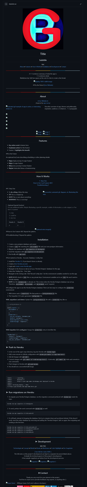

-testing
<!-- HEADER -->
<div align="center">

  <!-- SHIELDS -->
  <!-- For how-to notes on shield badges, see docs: https://shields.io/ -->


 


# MY WEB-DEV UTILITIES NPM PACKAGE


### This code is not exclusivley written by me ... it is just a list of files I use often during website development... use at your own risk


## Copy-2-Clipboard:


---

## Git-Html Preview-Tool:


---

## Markdown Templates:



---

## Text Tools:


---

## Automatic Table Of Contents Generator:


---

## Text-File-2-JS-Array:


---

### Usage:

```bash 
npm i web-dev-utils
```

</div>
---

```
.
├── GIT-HTML-PREVIEW-TOOL
│   └── GIT-HTML-PREVIEW-TOOL-master
├── Markdown-Templates-master
│   └── Markdown-Templates-master
│       └── images
├── TexTools-master
│   └── TexTools-master
│       ├── backup-stable-build
│       │   ├── css
│       │   └── js
│       ├── css
│       ├── js
│       └── sandbox
├── bootstrap-4.3.1-dist
│   ├── css
│   └── js
├── jquery
│   ├── dist
│   ├── external
│   │   └── sizzle
│   │       └── dist
│   └── src
│       ├── ajax
│       │   └── var
│       ├── attributes
│       ├── core
│       │   └── var
│       ├── css
│       │   └── var
│       ├── data
│       │   └── var
│       ├── deferred
│       ├── deprecated
│       ├── effects
│       ├── event
│       ├── exports
│       ├── manipulation
│       │   └── var
│       ├── queue
│       ├── traversing
│       │   └── var
│       └── var
├── loadashes6
│   └── lodash
│       └── fp
├── mout
│   ├── array
│   ├── collection
│   ├── date
│   │   └── i18n
│   ├── doc
│   ├── function
│   ├── lang
│   ├── math
│   ├── number
│   ├── object
│   ├── queryString
│   ├── random
│   ├── src
│   │   ├── array
│   │   ├── collection
│   │   ├── date
│   │   │   └── i18n
│   │   ├── function
│   │   ├── lang
│   │   ├── math
│   │   ├── number
│   │   ├── object
│   │   ├── queryString
│   │   ├── random
│   │   ├── string
│   │   └── time
│   ├── string
│   └── time
└── personal-utilities
    ├── Auto-table-Of-Contents
    ├── copy-2-clip
    ├── css
    ├── html
    ├── js
    └── prism

81 directories
```
