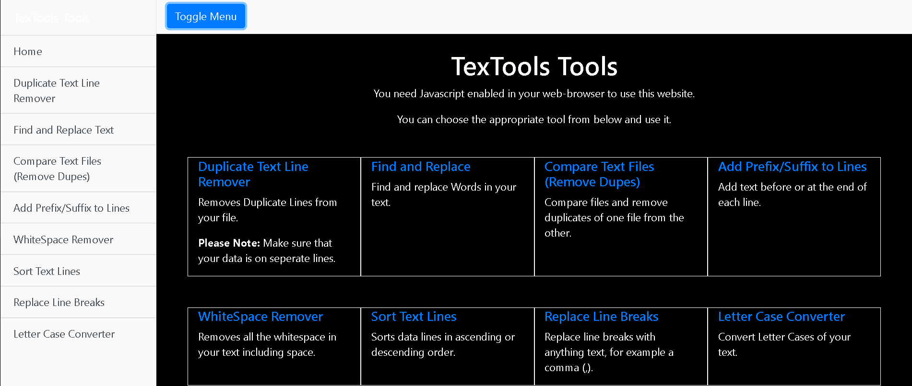
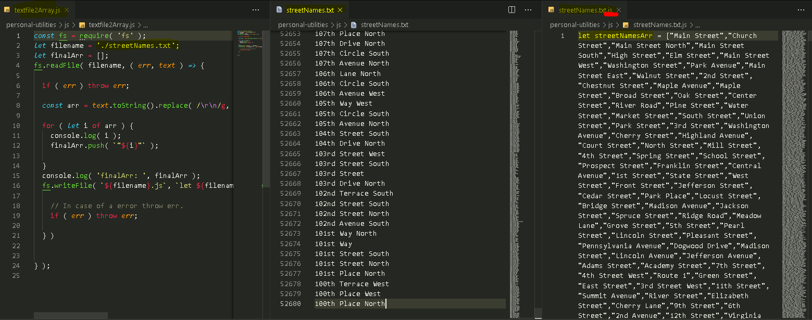

# Repo Utils

---


## [blog templates](https://bgoonz.github.io/repo-utils/)

---

<!-- HEADER -->
<div align="center">

  <!-- SHIELDS -->
  <!-- For how-to notes on shield badges, see docs: https://shields.io/ -->


# MY REPO UTILITIES NPM PACKAGE

### This code is not exclusivley written by me ... it is just a list of files I use often during website development... use at your own risk

## Copy-2-Clipboard:


---

## Git-Html Preview-Tool:


---

## Markdown Templates:


---

## Text Tools:



---

## Automatic Table Of Contents Generator:


---

## Text-File-2-JS-Array:



---

### Usage:

```bash
npm i repo-utils
```

---

---

#Useful Commands!

---

---

---

||
||
V
</center>

## 1. Download Links of a specific file extension from website

```bash

 wget -r -A.pdf https://overapi.com/gitwget --wait=2 --level=inf --limit-rate=20K --recursive --page-requisites --user-agent=Mozilla --no-parent --convert-links --adjust-extension --no-clobber -e robots=off
```

## 2. Download Website for ofline use...

```bash
sudo apt install httrack
httrack --ext-depth=2 _**url**_
```

---

---

## 3. Recursivley remove files named cookies.txt

```bash

find . -name cookies.txt -type f -exec rm -rf {} \;
```

---

---

## 4. Recursivley remove lines of text contaning the string badFolder from files in the working directory.

```bash
find . -type f -exec sed -i '/badFolder/d' ./* {} \;
```

---

---

## 5. Recursivley Install node_modules

```bash

npm i -g recursive-install


npm-recursive-install
```

---

---

## 6. Recursivley Exicute any sequence of commands

```bash
function RecurseDirs ()
{
    oldIFS=$IFS
    IFS=$'\n'
    for f in "$@"
    do

  # YOUR CODE HERE!
   for file in *; do mv "$file" `echo $file | tr ' ' '_'` ; done


        if [[ -d "${f}" ]]; then
            cd "${f}"
            RecurseDirs $(ls -1 ".")
            cd ..
        fi
    done
    IFS=$oldIFS
}
RecurseDirs "./"


```

---

---

## 7. Copy any text between <**script**> tags in a file called _example.html_ to be inserted into a new file: _out.js_

```bash
sed -n -e '/<script>/,/<\/script>/p' example.html >out.js
```

---

---

## 8. Recursivley Delete node_modules folders

```bash
find . -name 'node_modules' -type d -print -prune -exec rm -rf '{}' +
```

---

---

## 9. Sanatize file and folder names to remove illegal characters and reserved words.

```bash
sanitize() {
  shopt -s extglob;

  filename=$(basename "$1")
  directory=$(dirname "$1")

  filename_clean=$(echo "$filename" | sed -e 's/[\\/:\*\?"<>\|\x01-\x1F\x7F]//g' -e 's/^\(nul\|prn\|con\|lpt[0-9]\|com[0-9]\|aux\)\(\.\|$\)//i' -e 's/^\.*$//' -e 's/^$/NONAME/')

  if (test "$filename" != "$filename_clean")
  then
    mv -v "$1" "$directory/$filename_clean"
  fi
}

export -f sanitize

sanitize_dir() {
  find "$1" -depth -exec bash -c 'sanitize "$0"' {} \;

}

sanitize_dir '/path/to/somewhere'

```

---

---

## 10. Start postgresql in terminal

```bash

 sudo -u postgres psql
```

---

---

## 11. Add closing body and script tags to each html file in working directory.

```bash
for f in * ; do
  mv "$f" "$f.html"
doneecho "<form>
 <input type="button" value="Go back!" onclick="history.back()">
</form>
  </body></html>" | tee -a *.html
```

---

---

## 12. Batch Download Videos

```bash
#!/bin/bash


link="#insert url here#"
#links were a set of strings with just the index of the video as the variable

num=3
#first video was numbered 3 - weird.

ext=".mp4"

while [ $num -le 66 ]
do
      wget $link$num$ext -P ~/Downloads/
      num=$(($num+1))
done
```

---

---

## 13. Change File Extension from '.txt' to .doc for all files in working directory.

```bash

  sudo apt install rename


rename 's/\.txt$/.doc/' *.txt

```

## 14. Recursivley change any file with extension .js.download to .js

```bash
find . -name "*.\.js\.download" -exec rename 's/\.js\.download$/.js/' '{}' +
```

---

---

## 15. Copy folder structure including only files of a specific extension into an ouput Folder

```bash
find . -name '*.md' | cpio -pdm './../outputFolder'
```

---

---

# **PANDOC!!!**

---

---

> sudo apt install pandoc
>
> 1```bash
> pandoc -s file.txt -o file.rtf---

```bash


pandoc *.md> -o _example.html

```

---

---

```bash
find ./ -iname "*.html" -type f -exec sh -c 'pandoc "${0}" -o "${0%.html}.md"' {} \;
```

---

---

```bash


find ./ -iname "*.md" -type f -exec sh -c 'pandoc "${0}" -o "${0%.md}.html"' {} \;


for f in *.html; do printf '%s\n' 0a '<!DOCTYPE html>
<html lang="en">
<head>
  <meta charset="UTF-8">
  <meta name="viewport" content="width=device-width, initial-scale=1.0">
  <title>Document</title>
<link rel="stylesheet" href="https://stackpath.bootstrapcdn.com/bootstrap/4.5.2/css/bootstrap.min.css" integrity="sha384-JcKb8q3iqJ61gNV9KGb8thSsNjpSL0n8PARn9HuZOnIxN0hoP+VmmDGMN5t9UJ0Z" crossorigin="anonymous">
<link rel="stylesheet" href="./prism.css">
<script async defer src="./prism.js"></script>
</head>
<body>;' . x | ex "$f"; done
echo "<form>
 <input type="button" value="Go back!" onclick="history.back()">
</form>
  </body></html>" | tee -a *.html
```

---

---

```bash
for x in "./"/*/; do
  (cd "$x"
   files=(*)
   printf '%s\n' "${files[@]}" > deleteme.txt
  )
done

```

---

---

```bash
find . -size +75M -a -print -a -exec rm -f {} \;
```

---

---

```bash
find . \( -name ".git" -o -name ".gitignore" -o -name ".gitmodules" -o -name ".gitattributes" \) -exec rm -rf -- {} +
```

---

---

> check what you are about to delete before deleting:

```bash
find . -name "*.zip" -type f -print

#Delete:

find . -name "*.zip" -type f -print -delete#!/bin/sh
```

---

---

```bash
find ./ | sed -E -e 's/([^ ]+[ ]+){8}//' | grep -i "\.*$">files
listing="files"

out=""

html="index.html"
out="basename $out.html"
html="index.html"
cmd() {

  echo '  <!DOCTYPE html>'
  echo '<html>'
  echo '<head>'

  echo '  <meta http-equiv="Content-Type" content="text/html">'

  echo '  <meta name="Author" content="Bryan Guner">'
  echo '<link rel="stylesheet" href="./assets/prism.css">'
  echo ' <link rel="stylesheet" href="./assets/style.css">'
  echo ' <**script** async defer src="./assets/prism.js"></**script**>'

  echo "  <title> directory </title>"

  echo ""
  echo '<style>'


echo '    a {'
echo '      color: black;'
echo '    }'
echo ''
echo '    li {'
echo '      border: 1px solid black !important;'
echo '      font-size: 20px;'
echo '      letter-spacing: 0px;'
echo '      font-weight: 700;'
echo '      line-height: 16px;'
echo '      text-decoration: none !important;'
echo '      text-transform: uppercase;'
echo '      background: #194ccdaf !important;'
echo '      color: black !important;'
echo '      border: none;'
echo '      cursor: pointer;'
echo '      justify-content: center;'
echo '      padding: 30px 60px;'
echo '      height: 48px;'
echo '      text-align: center;'
echo '      white-space: normal;'
echo '      border-radius: 10px;'
echo '      min-width: 45em;'
echo '      padding: 1.2em 1em 0;'
echo '      box-shadow: 0 0 5px;'
echo '      margin: 1em;'
echo '      display: grid;'
echo '      -webkit-border-radius: 10px;'
echo '      -moz-border-radius: 10px;'
echo '      -ms-border-radius: 10px;'
echo '      -o-border-radius: 10px;'
echo '    }'
echo '  </style>'
  echo '</head>'

  echo '<body>'

  echo ""

  #################### continue with the HTML stuff:

  echo ""

  echo ""

  echo "<ul>"

  awk '{print "<li><a href=\""$1"\">",$1,"&nbsp;</a></li>"}' $listing

  # awk '{print "<li>"};

  #   {print " <a href=\""$1"\">",$1,"</a></li>&nbsp;"}' \ $listing

  echo ""

  echo "</ul>"

  echo "<form>
 <input type="button" value="Go back!" onclick="history.back()">
</form>
  </body>"

  echo "</html>"

}

---

cmd $listing --sort=extension >>$html
```

---

---

```bash
sudo apt install uniq


uniq -u input.txt output.txt
```

---

---

```git
git filter-branch --index-filter 'git rm -r --cached --ignore-unmatch assets/_website-components/0-DOJO/widgets-master/output/info/stats.json' HEAD
```

---

---

```bash
find ./ | grep -i "\.html*$"
ls -R './' | awk '
/:$/&&f{s=$0;f=0}
/:$/&&!f{sub(/:$/,"");s=$0;f=1;next}
NF&&f{ print s"/"$0 }'>listing.md
```

---

---

# Recursivley remove from all html files any lines contaning the string "badText"

```bash
find . -type f -exec sed -i '/badText/d' ./*.html {} \;
```

---

---

#install unzip:

```bash
sudo apt install unzip

# recursivley unzip all zip files into a folder by the same name:
find . -name "*.zip" | while read filename; do unzip -o -d "`dirname "$filename"`" "$filename"; done;
```

---

# recursivley delete .zip files when done:

```bash
find . -name "*.zip" -type f -print -delete
```

---

---

```bash
n=1;
max=50;
while [ "$n" -le "$max" ]; do
  mkdir "s$n"
  n=`expr "$n" + 1`;
done
```

---

---

```git
  git config --global credential.helper store
```

---

---

```bash


sed -i '/target-string/d' ./js-in-one-page.html
```

# examples:

```bash
sed -i '/\.git/d' ./index.html

# Recursive


find . -type f -a \( -name "*.html" -o -name "*.js" -o -name "*.css" -o -name "*.md" \) -a -exec sed -i  '/BADSTRING/d' '{}' +

```

---

---

```bash
# recursivley remove empty files

find . -empty -type f -print -delete


# recursivley remove empty folders
find . -empty -type d -print -delete

```

---

---

# recursively remove .git folder, .gitignore file and .gitmodules file and .gitattributes file

```bash
find . \( -name ".git" -o -name ".gitignore" -o -name ".gitmodules" -o -name ".gitattributes" \) -exec rm -rf -- {} +
```

---

---

# Recursivley remove security, release, changelog, License & contributing files

```bash


find . \( -name "*SECURITY.txt" -o -name "*RELEASE.txt" -o  -name "*CHANGELOG.txt" -o -name "*LICENSE.txt" -o -name "*CONTRIBUTING.txt" -name "*HISTORY.md" -o -name "*LICENSE" -o -name "*SECURITY.md" -o -name "*RELEASE.md" -o  -name "*CHANGELOG.md" -o -name "*LICENSE.md" -o -name "*CODE_OF_CONDUCT.md" -o -name "*CONTRIBUTING.md" \) -exec rm -rf -- {} +
```

---

---

## </div>

```
.
├── ./Auto-table-Of-Contents
│   ├── ./Auto-table-Of-Contents/toc.css
│   └── ./Auto-table-Of-Contents/toc.js
├── ./LICENSE
├── ./README.md
├── ./TREE.md
├── ./bash-scripts
│   ├── ./bash-scripts/APPEND-DIR.js
│   ├── ./bash-scripts/Download-all-weblinks-of-certain-file-type.sh
│   ├── ./bash-scripts/Download-website.sh
│   ├── ./bash-scripts/File_Transfer.sh
│   ├── ./bash-scripts/Recursively-remove-files-byname.sh
│   ├── ./bash-scripts/Recursively-remove-folders-byname.sh
│   ├── ./bash-scripts/Recusrive-npm-install.sh
│   ├── ./bash-scripts/Remove-script-tags-from-html.sh
│   ├── ./bash-scripts/Resursivleydeletenodemodules.sh
│   ├── ./bash-scripts/Sanatize-directory.sh
│   ├── ./bash-scripts/Windows-WSL-Postgres-terminal-prompt-command.sh
│   ├── ./bash-scripts/add-extension-to-files-in-folder.sh
│   ├── ./bash-scripts/add-text-2-end-of-file.sh
│   ├── ./bash-scripts/batch-download-videos.sh
│   ├── ./bash-scripts/change-file-extensions.sh
│   ├── ./bash-scripts/clone-folder-structure-populate-with-specific-file-type.sh
│   ├── ./bash-scripts/clone-folder-structure-without-files.sh
│   ├── ./bash-scripts/concatinate-all-html-files.sh
│   ├── ./bash-scripts/concatinate-markdown-files-to-single-html.sh
│   ├── ./bash-scripts/convert-html-2-md.sh
│   ├── ./bash-scripts/convert-markdown-2-html.sh
│   ├── ./bash-scripts/create-dummy-text-file-4-every-subfolder.sh
│   ├── ./bash-scripts/delete-files-bigger-than.sh
│   ├── ./bash-scripts/delete-git-files.sh
│   ├── ./bash-scripts/delete-zip.sh
│   ├── ./bash-scripts/generate-directory-index.html-from-files-in-working-directory.sh
│   ├── ./bash-scripts/get-links-from-webpage.sh
│   ├── ./bash-scripts/gistfile1.txt
│   ├── ./bash-scripts/git-filter-branch.sh
│   ├── ./bash-scripts/list-html-files.sh
│   ├── ./bash-scripts/output.md
│   ├── ./bash-scripts/print-file-paths-recursive.sh
│   ├── ./bash-scripts/recursive-action.sh
│   ├── ./bash-scripts/recursive-remove-lines-contaning-string.sh
│   ├── ./bash-scripts/recursive-unzip.sh
│   ├── ./bash-scripts/recursivley-create-numbered-folders.sh
│   ├── ./bash-scripts/remember-git-credentials.sh
│   ├── ./bash-scripts/remove-invalid-characters-from-file-names.sh
│   ├── ./bash-scripts/remove-lines-contaning-string.sh
│   ├── ./bash-scripts/remove-space-from-filenames.sh
│   ├── ./bash-scripts/remove-string-from-file-names.sh
│   ├── ./bash-scripts/remove-trailing-whitespace-from-file-names.sh
│   ├── ./bash-scripts/remove-unnecessary-files-folders.sh
│   └── ./bash-scripts/right.html
├── ./commands.txt
├── ./copy-2-clip
│   ├── ./copy-2-clip/README.md
│   ├── ./copy-2-clip/copy-2-clip.css
│   ├── ./copy-2-clip/copy-2-clip.js
│   └── ./copy-2-clip/recursion.html
├── ./css
│   └── ./css/gradient.css
├── ./favicon.ico
├── ./img
│   ├── ./img/101948313_3560363123980817_2358876238887518208_n.jpg
│   ├── ./img/back.jpeg
│   ├── ./img/banner.jpg
│   ├── ./img/circle-cropped (2).png
│   ├── ./img/circle-cropped.png
│   ├── ./img/cool-background.png
│   ├── ./img/data-struc.gif
│   ├── ./img/data-struc2.gif
│   ├── ./img/doc1-2.-inverted.png
│   ├── ./img/doc1-2.png
│   ├── ./img/docs.png
│   ├── ./img/ds-algo.gif
│   ├── ./img/dtw.gif
│   ├── ./img/dtw.png
│   ├── ./img/git-html-preview.gif
│   ├── ./img/imageonline-co-overlayed-image - Copy.png
│   ├── ./img/imageonline-co-overlayed-image.png
│   ├── ./img/lambda-demo.gif
│   ├── ./img/lambda-demo1.gif
│   ├── ./img/links.gif
│   ├── ./img/logos
│   │   ├── ./img/logos/FINAL.mp4
│   │   ├── ./img/logos/FINAL.png
│   │   ├── ./img/logos/betterfit.PNG
│   │   ├── ./img/logos/betterfit_auto_x2_colored_toned.png
│   │   ├── ./img/logos/circle-cropped (1).png
│   │   ├── ./img/logos/circle-cropped.png
│   │   ├── ./img/logos/enhanced (1).mp4
│   │   ├── ./img/logos/enhanced (1).png
│   │   ├── ./img/logos/enhanced (1)_Trim.mp4
│   │   ├── ./img/logos/enhanced.png
│   │   ├── ./img/logos/final-logo.png
│   │   ├── ./img/logos/iconified
│   │   │   ├── ./img/logos/iconified/apple-touch-icon-114x114.png
│   │   │   ├── ./img/logos/iconified/apple-touch-icon-120x120.png
│   │   │   ├── ./img/logos/iconified/apple-touch-icon-144x144.png
│   │   │   ├── ./img/logos/iconified/apple-touch-icon-152x152.png
│   │   │   ├── ./img/logos/iconified/apple-touch-icon-180x180.png
│   │   │   ├── ./img/logos/iconified/apple-touch-icon-57x57.png
│   │   │   ├── ./img/logos/iconified/apple-touch-icon-72x72.png
│   │   │   ├── ./img/logos/iconified/apple-touch-icon-76x76.png
│   │   │   ├── ./img/logos/iconified/apple-touch-icon.png
│   │   │   ├── ./img/logos/iconified/favicon.ico
│   │   │   └── ./img/logos/iconified/iconifier-readme.txt
│   │   ├── ./img/logos/logo (1).png
│   │   ├── ./img/logos/logo-animated (1).gif
│   │   ├── ./img/logos/logo-animated (1).jpg
│   │   ├── ./img/logos/logo-animated.mp4
│   │   ├── ./img/logos/logo-final-touchup.PNG
│   │   ├── ./img/logos/logo.PNG
│   │   ├── ./img/logos/logo_auto_x1.png
│   │   ├── ./img/logos/logo_auto_x1_auto_x2_colored_toned.png
│   │   ├── ./img/logos/mini-logo.png
│   │   └── ./img/logos/techniwave-logo.jpg
│   ├── ./img/mihir2.gif
│   ├── ./img/mihirbeg.gif
│   ├── ./img/music-profile.PNG
│   ├── ./img/my-back.png
│   ├── ./img/my-websites
│   │   ├── ./img/my-websites/1eb83ff46da1f1bf9d4227bd663a6c54.png
│   │   ├── ./img/my-websites/21ecc2f26e2641c8e9aae5479481bbe2 (3).png
│   │   ├── ./img/my-websites/21ecc2f26e2641c8e9aae5479481bbe2 (5).png
│   │   ├── ./img/my-websites/27697c1a901d3b3673aeb98edae4d2ae (2).png
│   │   ├── ./img/my-websites/51485b6b1a74262e7478709b66e0dd23 (4).png
│   │   ├── ./img/my-websites/5307d1df23eb389bb31a6cfe43def861 (5).png
│   │   ├── ./img/my-websites/53bd97097fd4a60cb9d6dce85fefabe8 (5).png
│   │   ├── ./img/my-websites/7a8bc98e902a2f6dea90386cdfb154c2.png
│   │   ├── ./img/my-websites/a1fe9eb14f2473255f3a7050b74f303b (1).jpg
│   │   ├── ./img/my-websites/bb090e30d34aa476398902baf0527dc3 (1).jpg
│   │   ├── ./img/my-websites/bb090e30d34aa476398902baf0527dc3 (3).jpg
│   │   ├── ./img/my-websites/e52475b93e4c589140a961f6ec6a8d7e (4).png
│   │   ├── ./img/my-websites/e8fe6085906d342bb17186bf6616a6cf.png
│   │   ├── ./img/my-websites/fdc8babfb876d5238b83ffaf876dc0dd (4).png
│   │   └── ./img/my-websites/fdc8babfb876d5238b83ffaf876dc0dd.png
│   ├── ./img/noo.jpg
│   ├── ./img/posts.PNG
│   ├── ./img/pure-data.png
│   ├── ./img/python.png
│   ├── ./img/react.gif
│   ├── ./img/sine-wav-bak.gif
│   ├── ./img/skills - Copy.png
│   ├── ./img/skills.png
│   ├── ./img/social.png
│   ├── ./img/space.gif
│   └── ./img/svg-logos
│       └── ./img/svg-logos/logo-mibile.svg
├── ./js
│   ├── ./js/streetNames.txt
│   ├── ./js/streetNames.txt.js
│   └── ./js/textfile2Array.js
├── ./makefile
├── ./markdown-templates
│   ├── ./markdown-templates/BLANK_README.md
│   ├── ./markdown-templates/MAIN-README.md
│   ├── ./markdown-templates/README.md
│   ├── ./markdown-templates/Standard-Project-README.md
│   ├── ./markdown-templates/alt-README.md
│   ├── ./markdown-templates/filled-out-readme.md
│   ├── ./markdown-templates/images
│   │   ├── ./markdown-templates/images/logo.png
│   │   └── ./markdown-templates/images/screenshot.png
│   ├── ./markdown-templates/notes-template.md
│   └── ./markdown-templates/readme-alt-2.md
├── ./package-lock.json
├── ./package.json
├── ./prism
│   ├── ./prism/prism.css
│   └── ./prism/prism.js
├── ./python-scripts
└── ./robots.txt

14 directories, 157 files


81 directories
```
